# Uso y preparación de los datos

Al iniciar cualquier estudio debemos tener en cuenta que sin un buen conjunto de datos la mayoría de las técnicas que implementaremos darán resultados muy pobres. Si descuidamos la calidad de los datos, nuestros análisis se alejarán de la realidad que intentamos representar. La existencia de puntos atípicos,  variables sin datos o con errores, pueden ser una verdadera pesadilla al iniciar nuestro estudio, por tal razón los lenguajes poseen herramientas que nos permiten manejar correctamente estas situaciones. En esta sección estudiaremos las herramientas básicas que *R* y *Phyton*   ofrecen a todo analista que inicie un proyecto con datos con los cuales no esté familiarizado.

## Lectura de datos

En general hay tres tipos de datos básicos con los cuales nos enfrentaremos, los cuales son archivos con extensiones *.csv*, *.txt*, *xls*. Existen otras extensiones pero es muy raro que tenga que trabajar con datos provenientes de ellas, estas extensiones pueden ser: *.docx*, *.pdf*, entre otras

### Lectura de datos con *R*

*RStudio* nos facilita mucho esta tarea, pues tiene una opción que nos permite cargar los datos y escoger la configuracion del archivo sin tener que programar, veremos como hacer esto de forma directa y luego de manera adicional presentaremos algunas funciones que hacen esta misma tarea.

+ Archivos *csv* o *txt*: Primero buscamos en las opciones que se encuentran disponibles en la parte superior de *RStudio* y selecionamos *archivo* o *file*, luego se desplegaran varias opciones de las cuales debemos seleccionar *Import Dataset* o *importar datos*, recomendamos utilizar la opción *From Text (readr)...*, debido a su alta variedad de opciones para cargar los datos.

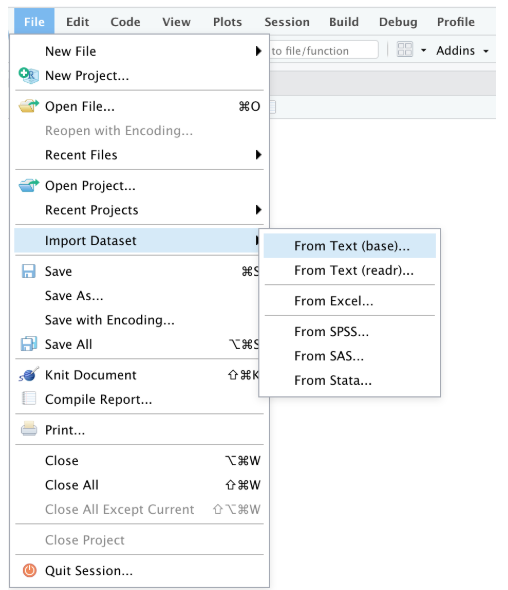

El paquete *readr* nos permite seleccionar las siguientes opciones 

(i) Cargar archivos directamente desde una ruta de nuestro computador o de una dirección web.

(ii) Seleccionar con un simple clic el tipo de datos de alguna columna en particular.

(iii) Mantener o eliminar columnas.

(iv) Cambiar el nombre al conjunto de datos.
 
(v) No usar una cantidad $N$ de las primeras filas del conjunto de datos.

(vi) Usar el encabezado como nombre de las columnas

(vii) Recortar espacios en los nombres

(viii) Cambiar los delimitadores de las columnas (separadas por comas, puntos y comas, tabulaciones, guiones, etc).

(ix) Seleccionar la codificación de los datos.

(x) Identificar de alguna forma en particular los valores *Na*  

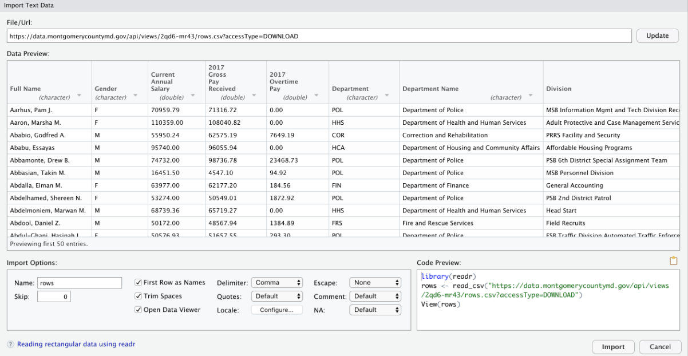

+ Archivos *.xls (MS-Excel)*: Para cargar archivos *.xls* debemos seleccionar la opción *From Excel* que se encuentra en la misma ubicación de las anteriores. Ésta opción usa el paquete *readxl*. La ventaja de este paquete es que posee prácticamente las mismas opciones que los paquetes de *R* básico para importar archivos de *Excel*, pero además permite seleccionar la hoja de cálculo a usar del documento *Excel*. La siguiente imagen representa lo que en general encontraremos al cargar un archivo *Excel*:

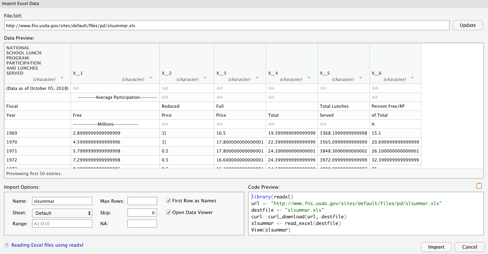

Gracias a *readxl* podemos simplificar y mejorar los datos, en la variable *skip* se coloca un valor numérico para indicar cuantas de las primera lineas se deben eliminar. Dando clic derecho sobre la variable  número 3 cambiamos el tipo que trae por defecto. A continuación se muestra la imagen.

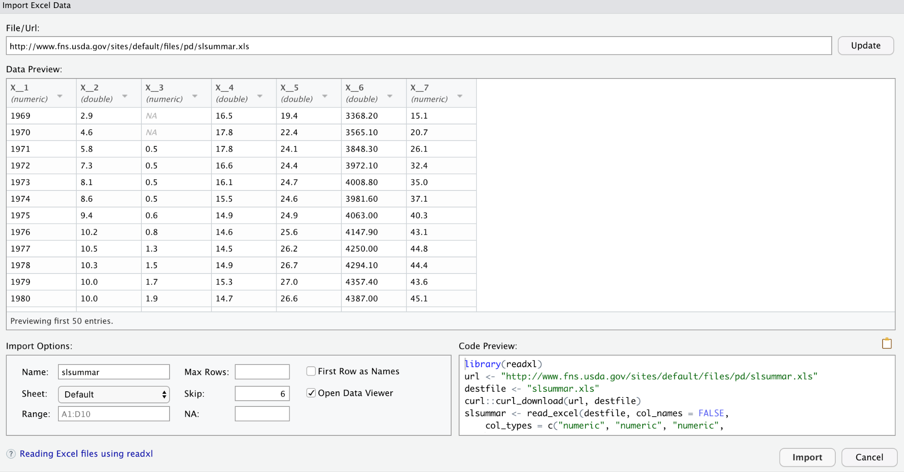
 
La importación de datos CSV o TXT puede hacerse directamente desde el R básico con paquetes especialmente diseñados para esta tarea.

### Lectura de datos con *Python*

La variedad de propósitos para los cuales se usa el lenguaje Python ha conducido a la existencia de una gran cantidad de formas de leer archivos *.csv*, *.txt*, *.xlx*. Sin embargo la gran mayoría de los especialistas en Machine Learning que utiliza este lenguaje, optan por la librería *Pandas* para la manipulación de datos. Por esta razón usaremos la funciones que nos ofrece *Pandas*: *pandas.read_csv()* y *pandas.read_excel()*.
Ambas funciones aceptan una gran cantidad de parámetros, pero solo mencionaremos los más importantes. Una información mas detallada sobre estas funciones pueden encontrarse en:

- <https://pandas.pydata.org/pandas-docs/stable/reference/api/pandas.read_csv.html> 

- <https://pandas.pydata.org/pandas-docs/stable/reference/api/pandas.read_excel.html>
 
A diferencia de *RStudio* no hay una forma en común para cargar los archivos, sin que tengamos que escribir algunas líneas de código. A continuación mostraremos como hacerlo:

+ filepath_or_buffer: Ruta del archivo o dirección web.

+ Sep: valor que separa los datos, por defecto es una coma

+ header: Se usa para identificar en que posición se encuentra la fila que será usada como los nombres de las columnas.

- *names*: Lista con el nombre de las columnas a usar.

- *index_col*: Columna que será usada por defecto como índice

- *decimal*: Carácter que será usado como carácter decimal, por defecto es un punto

- *usecol*: Este parámetro nos permite decidir qué número de columnas usar.

- *dtype*: Tipo de dato de cada columna, por ejemplo {‘a’: np.float64, ‘b’: np.int32, ‘c’: ‘Int64’}.

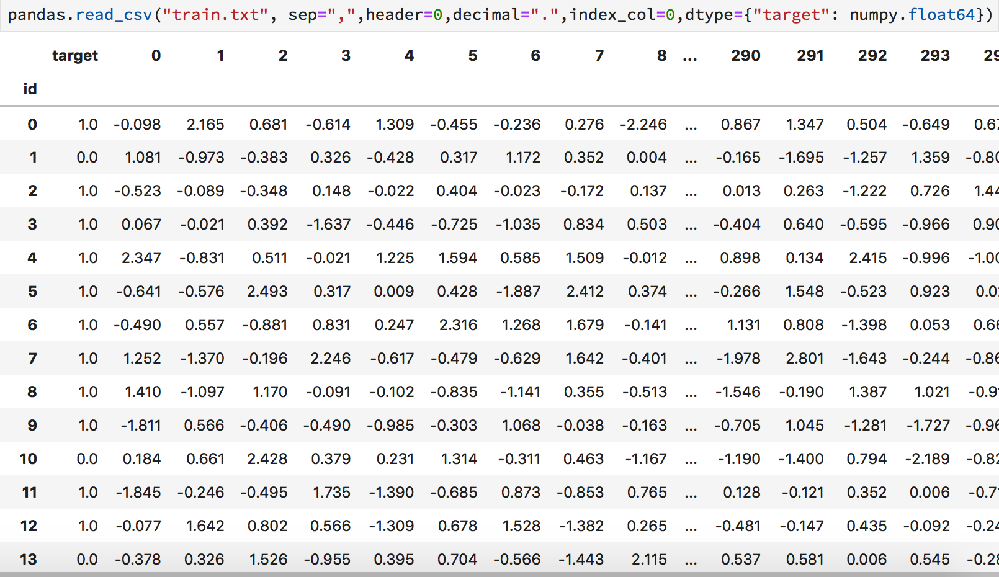

(ii) Leer archivos .*xlx* con *pandas.read_excel()*: Usa prácticamente los mismos parámetros que la función anterior, con la diferencia de que no acepta el parámetro *sep* y usa un parámetro adicional llamado *sheet_name*, este parámetro debe ser una lista con los números de columnas a usar o con los nombres de dichas columnas.
 

## Tratamiento previo de los datos

Luego de cargar los datos puede empezar la verdadera pesadilla para aplicar los métodos, debido a factores como errores de medición, problemas de codificación y errores humanos. En general clasificaremos estos problemas en dos grupos: *Valores Faltantes* o *Missing Values* y *Valores Atípico* más conocidos por el término en inglés *Outliers*.

### Missing Values o valores faltantes

Estos valores suelen generarse por diversas razones, entre las cuales se encuentran: problemas de codificación con los datos, errores de medición y errores humanos, entre otros. En algunos casos pueden generarse por problemas con la función que esté encargada de leer los datos, sea porque no lee bien los parámetros o simplemente por incompatibilidad del archivo. En esta sección veremos cuáles son las técnicas más usuales para solucionar estos problemas.

(i) Missing values en *R*: Para trabajar con datos faltantes en *R* lo primero es contarlos. Para ello usaremos la función *sapply()* la cual permite aplicar funciones a columnas de manera explícita. En nuestro caso aplicaremos la función *is.na()* la cual cuenta la cantidad de valores faltantes por columnas, la función *sum()* que suma todos estos valores y nos da el resultado final, y la función *dim()* la cual nos da las dimensiones de los datos.
 

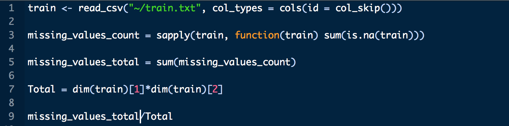

En general, los valores faltantes tienden a eliminarse, pero esto no se puede hacer a la ligera, en otros casos suelen sustituirse por un valor común del conjunto de datos (esto se hace cuando tenemos distintas entradas para un individuo y alguna característica está vacía). También se debe chequear si la distribución de datos faltantes es aleatoria. Sería muy extraño que cada 100 datos exactamente exista un dato faltante en un lugar en específico. Este último tipo de comportamiento hace pensar en que estamos en presencia errores sistemáticos.

Como tratar estos casos, dependerá de nuestros propósitos específicos, pues los datos faltantes tienden a sesgar de manera considerable muchas técnicas estadísticas. Cuando elegimos no usarlos decimos que los eliminaremos y cuando optamos por sustituirlos por un valor en específico diremos que los imputaremos.
Para eliminar los datos faltantes sin riesgo a perder información vital, lo primero que debemos asegurarnos es que la proporción de estos datos con el total sea muy bajo, por ejemplo 300:1, si los valores faltantes representaran el 1% de la población no es muy recomendable que los eliminemos. Un ejemplo típico es que pudieran representar un segmento de la población que por problemas de medición o de transmisión de los datos, simplemente no se pudo completar el llenado de información y el eliminarlos pudiera dejar por fuera una parte importante de la población. El 1% no parece significativo, pero si tenemos 3 millones de datos el 1% representaría 30 mil, una cantidad considerable, de posibles consumidores para un producto en específico.

Para eliminar los valores faltantes de la data por filas, usamos la función *na.omit()*, si queremos eliminar por columnas usamos la función *t()* la cual nos traspone los datos, el problema es que modificará el índice. Solventamos este problema con la función *rownames()*. Otro detalle es que la función *na.omit()* cambia el formato de los datos, por lo que usaremos la función *as.data.frame()* para corregir el problema.

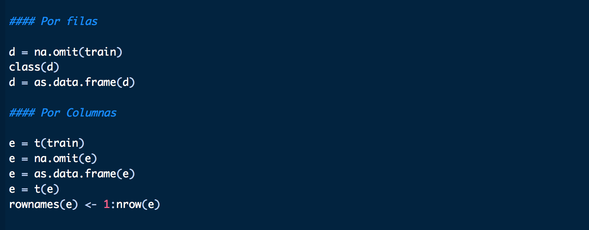

* Sustitución por la media: Cuando los datos poseen un comportamiento uniforme alrededor de una región del plano se suelen sustituir por el valor medio que presentan los datos.

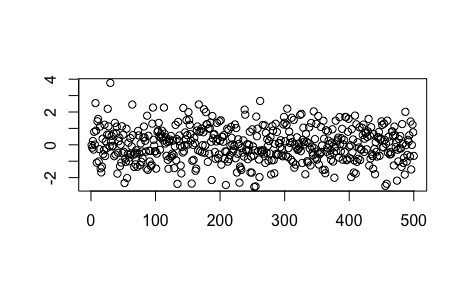

Para sustituir por el valor medio se utiliza la función *mean()* para calcular el valor medio de la columna y la función *replace()* para realizar el cambio.

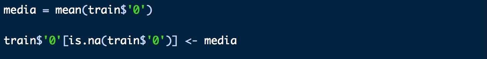

* Sustitución por la mediana: El problema de sustituir por la media es que ésta se puede ver afectada por valores atípicos (los veremos en la próxima sección de este capítulo), es por esto que debe sustituirse por la mediana que es un estimador más robusto para este propósito. Por ejemplo, el conjunto de puntos 1,2,3,1,2,1,3,1,2,1,2,1,33 tiene promedio 4, sustituir por este valor no tiene sentido, mientras que la mediana es 2. Para realizar el cambio usamos *median()*

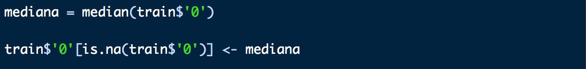

* Sustitución por la moda:   La sustitución por la moda es especialmente útil cuando estamos en presencia de datos categóricos, recordemos que la moda no es mas que el dato que más se repite en el conjunto de datos. Para realizar el cambio usamos *mode()*

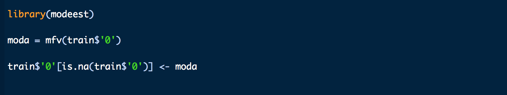

(ii) Missing values en *Python*:   Para identificar valores en Python a través de la librería Pandas existen diversas funciones que nos ayudarán. Lo primero que debemos hacer es contar la cantidad de datos faltantes, esto lo hacemos con las funciones *isnull()* y *sum()* de la librería Pandas. El resultado final será el número de missing values por columnas, la primera función los identifica y la segunda función los cuenta. La siguiente imagen muestra cómo hacerlo.

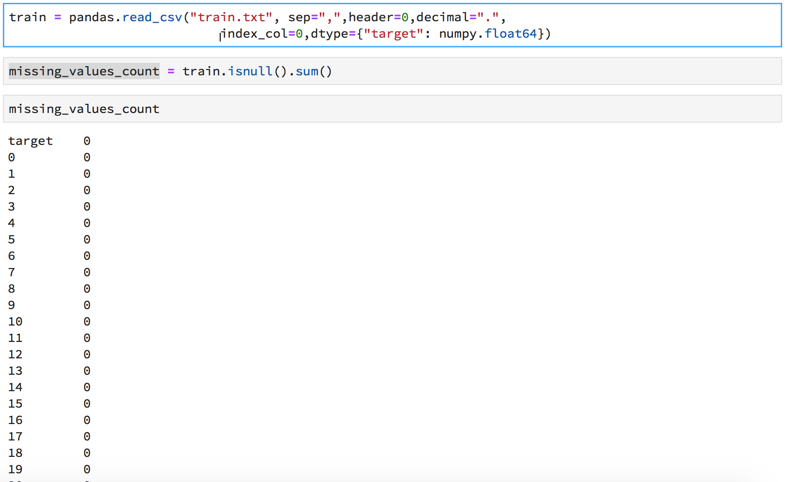

Ahora si decidimos eliminar los datos, realizar esto en *Python* es sencillo. Primero calculamos el porcentaje de datos faltantes usando las funciones *pandas.shape()*, *pandas.product()*. La primera nos indica la dimensión del dataframe y la segunda realiza la multiplicación para poder saber la cantidad de celdas existentes.

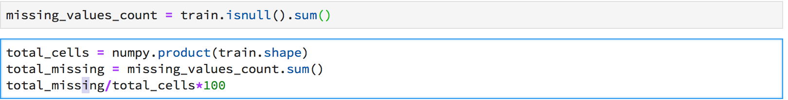

Luego, dependiendo como estén organizados los datos, es decir, registros por columnas o por filas, sabremos como eliminar los registros con valores faltantes. En la función *df.dropna()*, si colocamos como parámetros *axis=0* se eliminarán los registros por fila que contengan valores faltantes y *axis=1* por columnas.

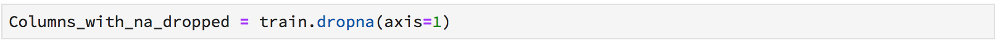

La otra alternativa con los datos faltantes es imputarlos. Para ello seguiremos el mismo procedimiento usado con *R*, es decir imputación por la media, mediana y moda.

* Sustitución por la media:  Para sustituir por el valor medio la función *.mean()* para calcular el valor medio de la columna y la función *.replace()* para realizar el cambio. 

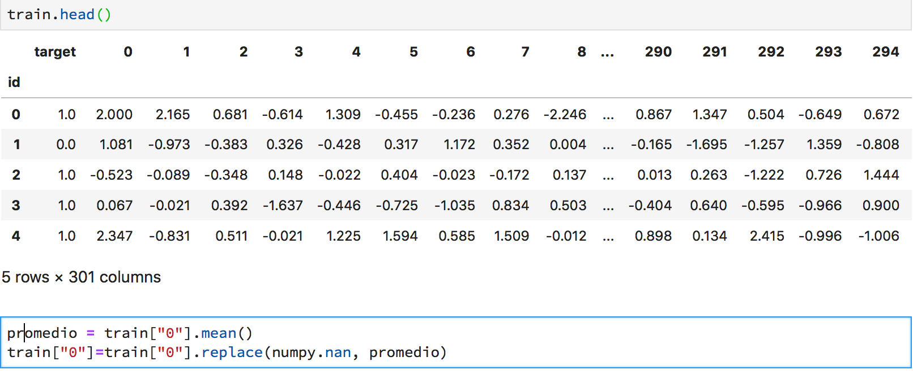

* Sustitución por la mediana: Para realizar el cambio usamos *.median()*

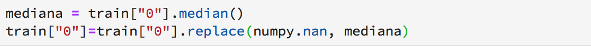

* Sustitución por la moda:  Para realizar el cambio usamos *.mode()*

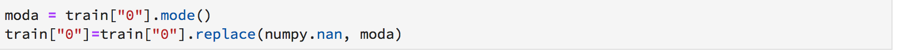

## Identificación y tratamientos de Outliers o puntos atípicos

Los puntos u observaciones atípicas como su nombre lo indica son observaciones que tienen un comportamiento distinto al de las demas observaciones, por ejemplo en el conjunto de datos 2, 3, 2, 4, 3, 2, 34, 3, 2, 1, 2 el valor 34 es un punto atípico. Existen varias razones fundamentales para lo cual es vital detectar estas observaciones entre las que podemos mencionar estan:

- Detectar errores en los datos: Si estamos observando un conjunto de datos donde en una colummna denotamos la edad de los individuos y un individuo tiene en esa entrada -5 o 335 claramente existe un error en los datos

- Encontrar un subconjunto distinto dentro del conjunto original: En algunos casos los valores atípicos señalan la existencias de individuos en particular, cuya existencia puede ser importantes en nuestros estudios.

- Para evitar estimaciones incorrectas en algunos modelos estadísticos: Algunos modelos estadisticos tienen fuertes restricciones en las hipotesis, es por esto que la eliminacion de algunos puntos atípicos puede mejorar de manera significativa nuestros resultados.

### Identificación de puntos atípicos

Estudiaremos los dos enfoques más populares: el visual y el cuantitativo

- Visual: Como su nombre lo indica consiste en analizar los datos de manera visual para identificar los valores atípicos. Por ejemplo, en la siguiente imagen podremos notar claramente un par de valores atípicos:

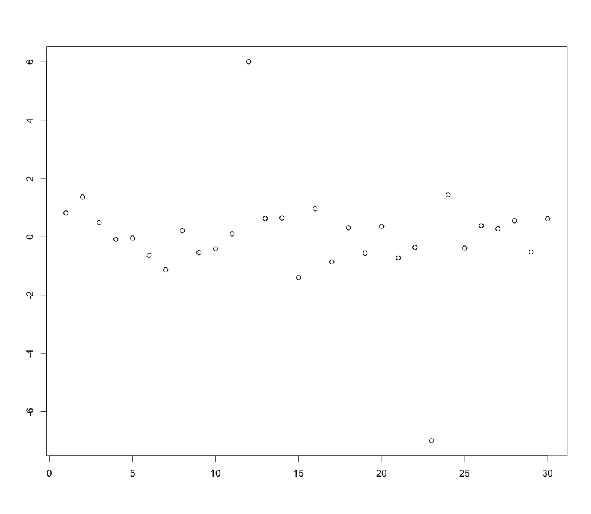

El problema se complica cuando aumenta la dimensionalidad del conjunto de datos, es decir, aumentan las categorías que poseen las observaciones. Por ejemplo, supongamos que tenemos un conjunto de datos con tres categorías $x_1$, $x_2$, $x_3$, $x_4$, en este caso lo usual es graficar el cruce de las variables para encontrar valores atípicos. El problema es que algunos cruces pueden no mostrar nada anormal, como es el cruce entre las variables $x_1$ y $x_2$.

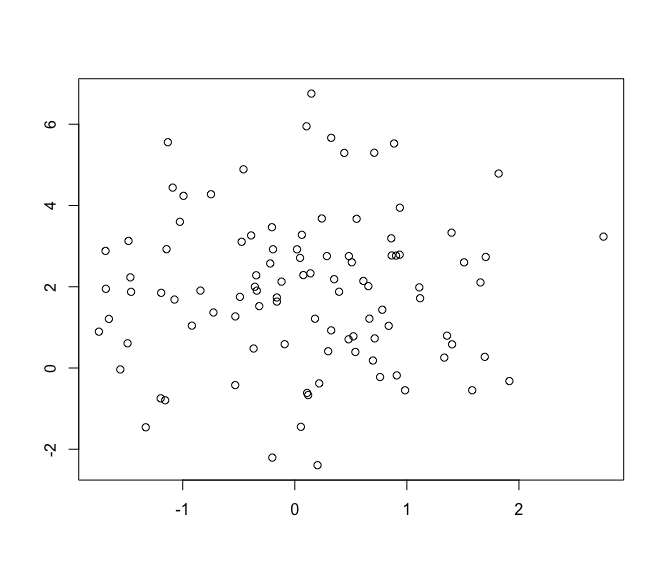

Pero al observar el cruce ente las variables $x_1$ y $x_3$ se puede detectar rápidamente el punto atípico.

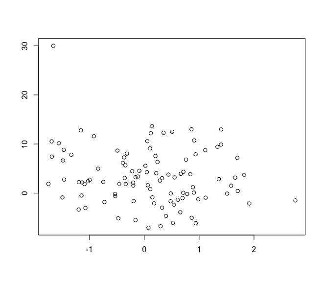

Ahora, es claro que este método puede ser muy ineficiente a la hora de trabajar con una gran cantidad de atributos, es por eso que existe la necesidad de usar algún método cuantitativo para medir si un dato es atípico o no. Uno de los más utilizado es el método basado en la medida o distancia $D_M$ de *Mahalanobis*

- $D_M$ de *Mahalanobis*:  Es una medida de distancia introducida por *Prasanta Chandra Mahalanobis* y su principal uso era determinar la similitud entre dos variables aleatorias. Su gran característica es que usa la matriz de covarianza para dar un peso ponderado por esta matriz a cada variable. Su gran desventaja es que es sensible a las escalas de los datos, por lo que se sugiere escalar los datos ya sea por su media u otro criterio similar.

En general, debemos tener un punto de referencia para poder medir la proximidad de los puntos que estamos midiendo, lo común es usar la media o la mediana, la ecuación que representa la distancia $D_M$ de *Mahalanobis* es:

$$\sqrt{(x-y)^{T} \Sigma^{-1}(x-y)}$$ 

Donde $y$ es el punto fijo de referencia, $x$ es el punto al que le estamos calculando la distancia y $\Sigma$ la matriz de covarianza.

### Detección de outliers en R

- Visual: Supongamos que tenemos el conjunto Data previamente cargado y compuesto por tres variables $x_1$, $x_2$ y $x_3$. Usaremos la función $plot()$, para observar la variable $x_1$. Usamos el siguiente comando:

Dando como resultado:

A primera vista no hay ningún valor atípico, sin embargo, si generamos el mismo gráfico para la variable $x_3$, obtenemos claramente un outlier:

Ahora si queremos hacer el cruce de variables, usamos igual el mismo comando, por ejemplo,  el de las variables $x_1$ y $x_2$, hacemos:

Aparentemente no se observan outliers, como muestra la siguiente imagen.

Ahora, si realizamos el cruce de las variables $x_1$ y $x_3$ obtenemos:

Observando claramente un outlier, que posee un valor de 30. Ahora si tenemos muchas variables, este proceso se complica, es por esto que usaremos la distancia $D_M$ de *Mahalanobis*.

- la distancia $D_M$ de *Mahalanobis*: Para calcular la distancia de Mahalanobis debemos calcular primero el punto de referencia, en nuestro caso la media, usaremos la función *apply()*, la función *cov()* para calcular la matriz de covarianza y al final usamos la función *mahalanobis()* indicándole los datos a calcular. Luego usamos la función *plot()* para ver la existencia de valores atípicos.

 

### Detección de outliers en Python

- Visual: Para identificar outliers de manera visual en *Python* haremos uso de la librería *Matplotlib*, la cual nos brinda un sinfín de herramientas para poder llevar a cabo nuestros objetivos. Al igual que en la sección anterior usaremos el conjunto de datos Data con tres variables.

Para ver la gráfica de la variable $x_1$, primero debemos seleccionar la variable, esto lo hacemos con el método *.iloc()* de *Pandas* el cual nos permite seleccionar subconjuntos de datos. Luego, usamos *plt.plot()* para generar la gráfica de los datos, el parámetro ro indica el tipo de gráfico, en nuestro caso en punteado; *plt.xlabel* para dar título al eje horizontal y *plt.ylabel* para dar título al eje vertical, finalmente usamos *plt.show* para mostrar la imagen.

Al graficar la variable $x_1$, se observa que carece de valores atípicos:

Pero cuando generamos el gráfico de la variable $x_3$ notamos el valor atípico:

Para realizar el gráfico del cruce de variables, simplemente agregamos la variable adicional como parámetro en *plt.plot()*.En este caso tampoco se observan valores atípicos.

Pero al realizar el cruce con las variables $x_1$ y $x_3$ notamos el valor atípico.

- La distancia $D_M$ de *Mahalanobis*: Para calcular la distancia de *Mahalanobis* de un conjunto de datos usando *Python*, usaremos la librería *Scipy* la cual trae por defecto una función para calcular la distancia de Mahalanobis. Primero debemos calcular la media de las columnas, usando la función *.mean()* de *Pandas*. A diferencia de *R*, debemos calcular la inversa de la matriz de covarianza (*Python* trae por defecto las filas y columnas intercambiadas con respecto a *R*), para ello usamos la funciones *.cov()*, la cual calcula la matriz de covarianza, *.linalg()* y *.inv()* para calcular la inversa. Luego, usando la función *apply()* de *Pandas* para aplicar la función *mahalanobis()* de la libreria *Scipy* a todo el conjunto de datos. En la función *.apply()* debemos colocar el nombre de la función, *axis* para indicar si la función aplica a las columnas o filas: el valor de $0$ para las columnas y $1$ para las filas. Finalizamos con *args* que contiene los parámetros que necesita la función, en nuestro caso el punto de referencia, el cual es la media por columnas y la inversa de la matriz de covarianza.

 

Podremos notar claramente un valor atípico en la siguiente imagen.

