# Regresión Lineal

La regresión lineal es un método estadístico que intenta predecir una variable de interés (dependiente) a partir de otras variables que se consideran influyentes (independientes) y se relacionan directamente con ella. Por ejemplo, hay estudios que sugieren la relacion entre el tamaño del pétalo ($P$) y el sépalo de una flor ($S$), en algunal flores se aproxima el tamaño del pétalo multiplicando por 3 el tamaño del sépalo, es decir, $P=3*S$, esta relación es un ejemplo simple de lo que es la regresión lineal de solo dos variables.

En general si tenemos una variable $y$ dependiente y $n$ variables independientes $x_1, x_2, ..., x_n$ un modelo de regresión lineal tiene la forma $$y=c+c_1x_1+c_2x_2+...+c_nx_n$$ donde los coeficientes $c_j$ son los coeficientes del modelo y $c$ es el coeficiente independiente, en algunos casos es llamado intercept.

## Identificando relación entre variables

Una de las primeras cosas a verificar antes de realizar el análisis de regresión es comprobar la relación existente entre la variable dependiente con las variables independientes, para lo cual existen diversas maneras de hacerlo:

- Visual: Se realiza un gráfico entre la variable dependiente y la variable independiente a estudiar, si se nota un tipo de linealidad entre los datos podemos pensar en incluir la variable independiente en el modelo. Por ejemplo, en el siguiente ejemplo se nota una cierta linealidad entre las variables.

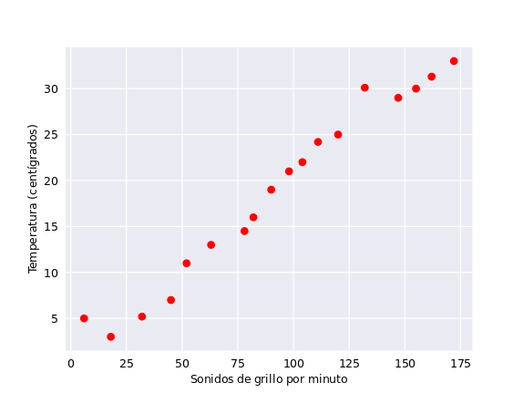

- Cuantitativa: Una manera cuantitativa de medir la relación entre variables es usar el índice de correlacion, el cual varía entre -1 y 1. Entre más cerca de -1 o 1 esté el índice de correlación entre variables, mayor es su relación, en general, decimos que existe correlación lineal entre las variables independientes si el índice de correlación entre las variables es mayor a 0.5 o menor a -0.5.  

Usaremos el conjunto de datos *mtcars* en *R* para ilustrar de ahora en adelante el proceso de regresión lineal. Los datos fueron extraídos de la revista Motor Trend US de 1974, y comprenden el consumo de combustible y 10 aspectos del diseño y rendimiento de los automóviles para 32 automóviles (modelos 1973-74).

### Identificando relación entre variables con *R*

- Visual: Usamos la función *plot()* vista previamente para graficar el cruce entre variables, por ejemplo, entre las variables *mpg* (Millas/(US) por galón) y *disp* (Desplazamiento) notamos un cierto comportamiento lineal.

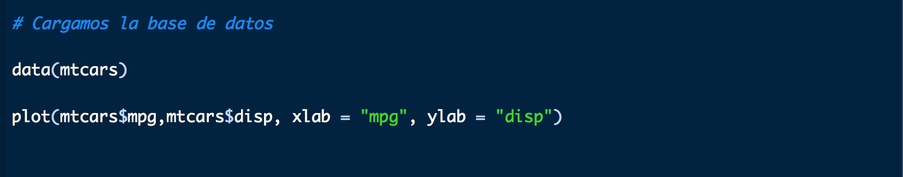

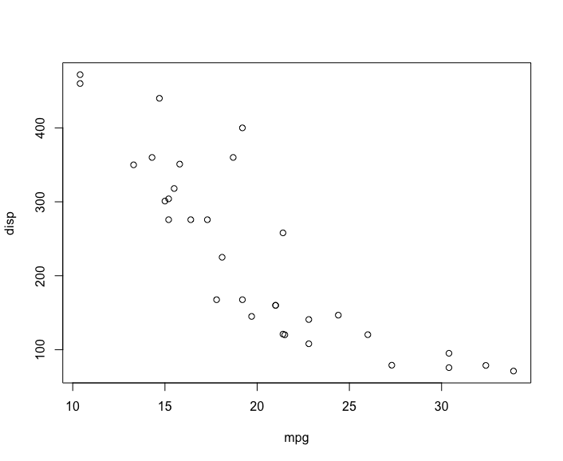

Con la función *plot()* tenemos la ventaja de que simplemente pasando como argumento el conjunto de datos arroja una imagen con todos los cruces posibles entre las once (11) variables de la base de datos mtcars.

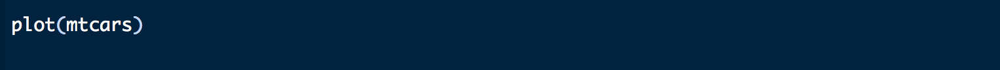

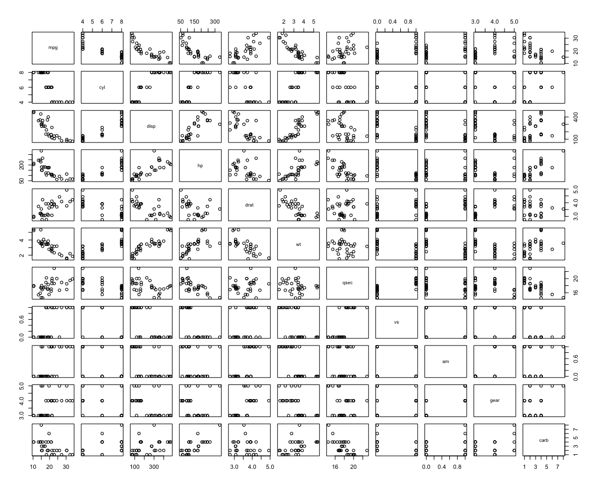

- Cuantitativa: La función *cor()* permite hallar la correlación entre las variables, por ejemplo entre *mpg* y *disp*

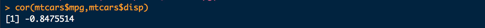
Este valor -0.84 nos confirma la posible relación que existe entre las variables *mpg* y *disp*. De igual manera podemos aplicar la función *cor()* a todo el conjunto de datos arrojando una matriz con todo los valores posibles de correlaciones.

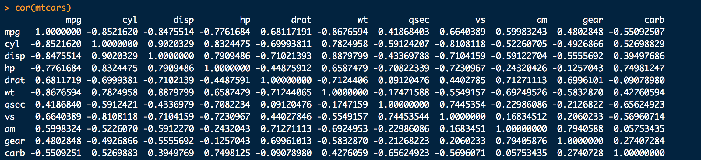

### Identificando relación entre variables con *Python*

- Visual: En Python usaremos de nuevo la librería *Matplotlib*, para obtener el gráfico del cruce entre variables, de igual manera notaremos el comportamiento lineal entre las variables.

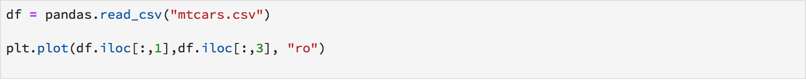

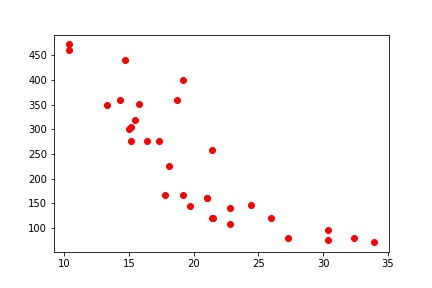

Ahora, si queremos realizar un solo gráfico con el cruce de todas las variables, como el caso de la función *cor()* en *R*, debemos implementar una librería llamada *Seaborn*, la cual arrojará el resultado deseado haciendo uso de la función *.pairplot()*, con los argumentos: *kind* (para el tipo de gráfico) y *palette* (para el color).

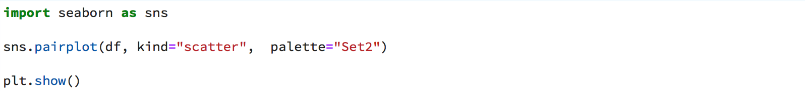

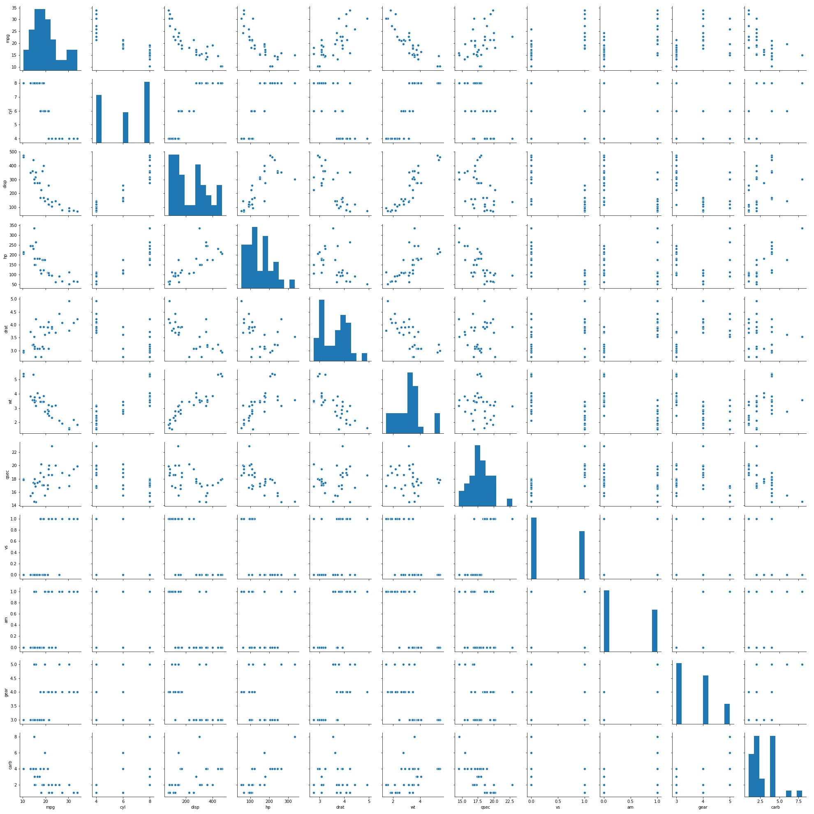

- Cuantitativo: Para obtener la matriz de correlación entre las variables de nuestro conjunto de datos, hacemos uso de la función *.cor()* de la librería *Pandas*. En el caso que queramos alguna correlación en específico filtramos los elementos de la matriz anterior.

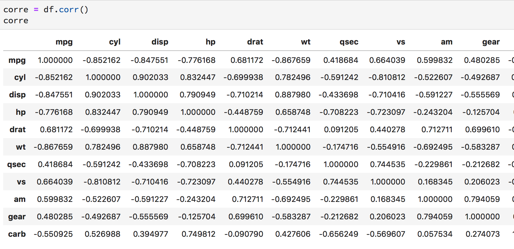

## Transformando variables

Una de las principales hipótesis en la regresión lineal es la normalidad de las variables implicadas, es decir, que las variables provengan de una distribución normal. Pero, ¿cómo identificamos este comportamiento en una variable? La forma más sencilla es inspeccionando el histograma proveniente de dicha variable y corroborando si existe un comportamiento acampanado, como en el siguiente ejemplo:

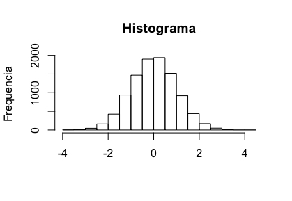

Pero en muchos casos, las variables no poseen este comportamiento, por lo tanto se debe aplicar transformaciones que imiten el comportamiento acampanado de la gráfica anterior. Las transformaciones más comunes son: $y=x^2$, $y=\sqrt{x}$, $y=ln(x)$ y $y=\frac{1}{x}$. En las siguientes gráficas podemos apreciar el efecto de estas transformaciones:

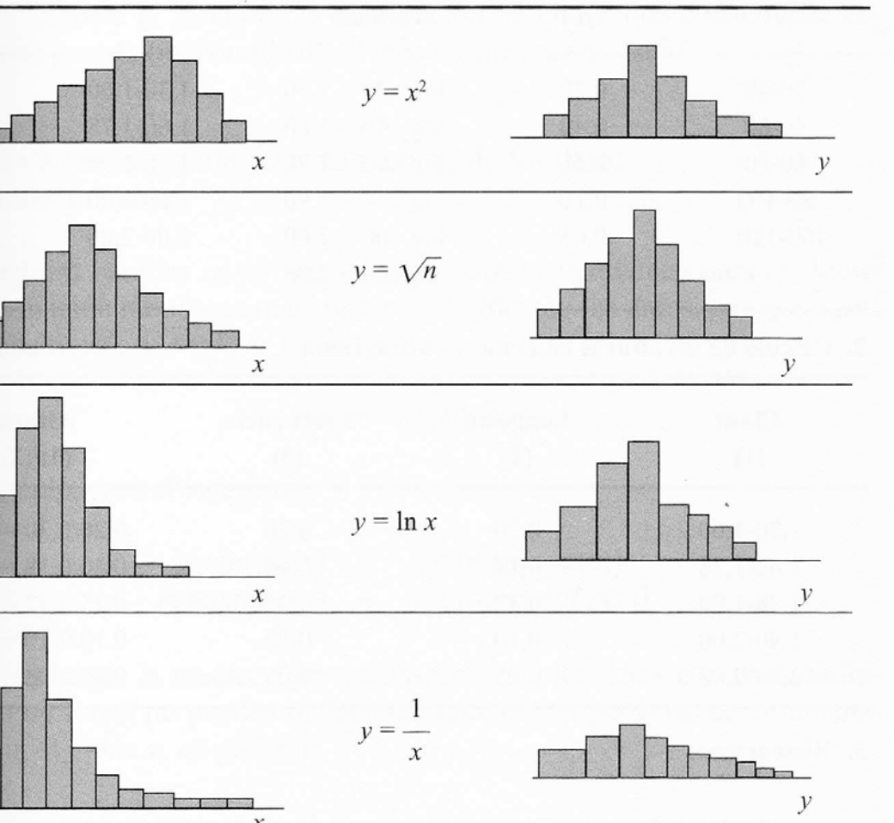

Esta última imagen nos da una idea de cuando debemos aplicar alguna de las transformaciones anteriores. Ahora veremos cómo aplicarlas en los respectivos lenguajes

### Aplicando transformaciones de variables en *R*

Esta tarea es muy fácil de ejecutar en *R*, supongamos que estamos trabajando con la variable *x* del conjunto de datos *df*, los códigos para realizar estas transformaciones son:

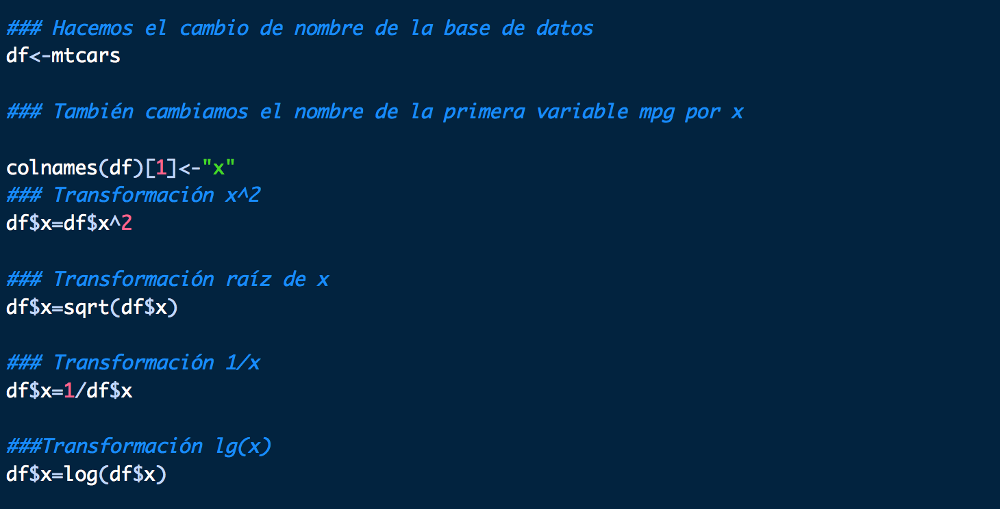

### Aplicando transformaciones de variables en *Python*

En Python es fácil realizar las transformaciones menos la del logaritmo, para la cual usaremos la librería *Math* en específico la función *.log()* junto a la función *.apply*, pues la función *.log()* se aplica a números y queremos aplicarla a una variable completa.

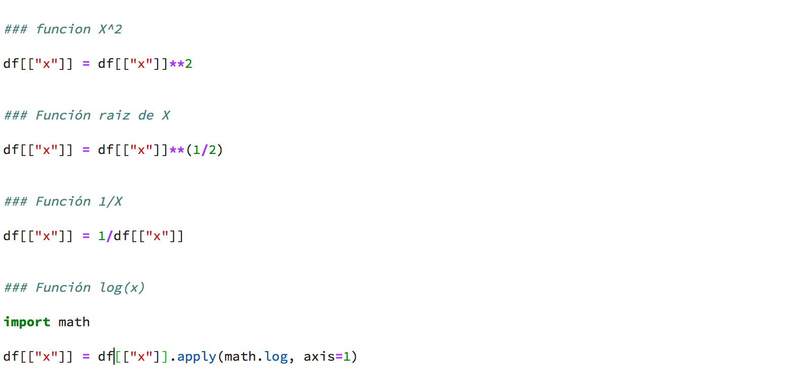

## Eliminando el efecto de colinealidad entre variables independientes.

Otra hipótesis importante antes de realizar el modelo de regresión, es la no colinealidad entre las variables, es decir, inexistencia de una relación lineal entre variables independientes. En caso de descubrir este efecto debemos eliminar una de estas variables y quedarnos con la otra.

La forma de identificar colinealidad es exactamente igual a la forma de encontrar correlaciones entre las variables vistas al principio de este capítulo. Primero calculamos el índice de correlación entre variables, si se encuentra una alta correlación entre un par de variables independientes se procede a revisar la gráfica del cruce de dichas variable, y si se observa una clara relación lineal procedemos a eliminar alguna de ellas.

## Eliminación de las variables categóricas

En los modelos de regresión lineal las variables categóricas no cumplen las hipótesis del modelo, pues no satisfacen el supuesto de normalidad. Recordemos que una variable categórica es una variable que toma unos valores fijos ya conocidos, por ejemplo, la variable que toma los valores 1,2,3,4,5,6 que representa los posibles valores que toma el lanzamiento de un dado, es una variable categórica, o la variable que toma los valores de Si o No que se refiere al consumo de un producto específico. Por lo tanto debemos saber cómo eliminar variables de nuestro conjunto de datos.

### Eliminación de variables en *R*

Supongamos que tenemos en un conjunto de datos llamados *mtcars* la variable *mpg* la cual deseamos eliminar. Para ello usamos el siguiente código, en el cual el símbolo *!* es el indicador para eliminar dicha variable.

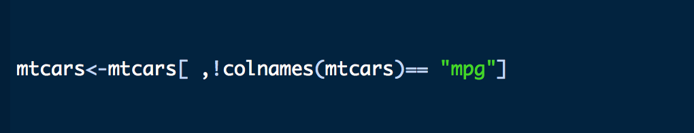

Para recuperar la columna eliminada se vuelve a cargar la base de datos *data(mtcars)*.

### Eliminación de variables en *Python*

De igual manera suponiendo que tenemos el mismo conjunto de datos y la misma variable a eliminar en *Python*, usamos la función *.drop()* para eliminar la variable, y denotamos *axis=1* para indicar que estamos eliminando una columna

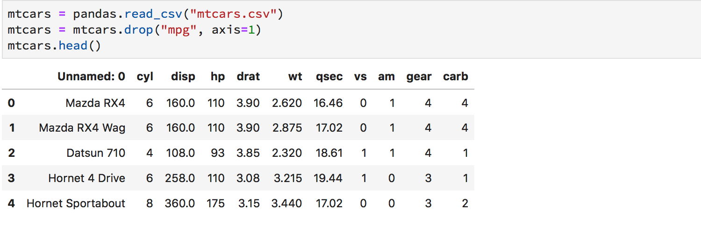

## Aplicando el modelo de regresión lineal

Una vez que elegimos las variables que deseamos usar en el modelo debemos conocer que funciones  y parámetros utilizar.

### Aplicando el modelo de regresión lineal en *R*

En *R* existen varias formas de aplicar este modelo, gracias al gran número de librerías existentes, sin embargo, ya *R* trae por defecto la función *lm()* la cual nos permite construir el modelo de una forma sencilla.

Primero describiremos los parámetros más importantes que debemos ingresar:

- *formula*: Sin duda el parámetro más importante. Es el que le indica a la función cuales son las variables independientes y la variable dependiente, por ejemplo si tenemos las variables $x_1$, $x_2$, $x_3$ donde las variables independientes son $x_2$ y $x_3$ y la variable dependiente es $x_1$, el paramétro formula debe ser : $x_1 \sim x_2 + x_3$. En el caso de que deseamos usar todas las variables del conjunto de datos como independientes, simplemente usamos $x_1 \sim .$

- *data*: El conjunto de datos a utilizar para realizar el modelo.

- *subset*: Un vector donde se especifican las filas a usar del modelo.

- *weights*: En el ajuste del modelo se calculan los parámetros que representan a cada variable independiente. Para realizar dicho ajuste se realiza un método de optimización para obtener los parámetros que mejor se ajusten a la recta de regresión. El parámetro *weights* es un vector numérico que se encarga de mejorar esta aproximación y debe coincidir con el número de observaciones

- *na.action*:En el caso de que existan valores *NAs*, este parámetro acepta una función que indica que hacer con estos valores problemas, lo usual es utilizar *na.fail*, *na.omit* o *na.exclude*

- *method*: Hace referencia al método de aproximación de los parámetros de los coeficientes. El método por defecto es el de los mínimos cuadrados, el cual se denota por *qr*

Ahora supongamos que tenemos un conjunto de datos llamados *irisP* el cual cuenta con la variable dependiente *Sepal.Length* y las variables independientes *Sepal.Width* , *Petal.Length*, *Petal.Width*. Para realizar el modelo con los parámetros ya mencionados tenemos dos opciones, la primera colocando el nombre de todas las variables o haciendo uso de la abreviación de la formula ya mencionado.

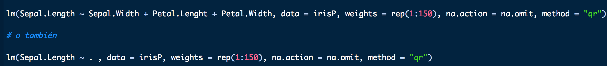

Si hacemos uso del código anterior obtendremos la información básica del modelo, la cual se presenta en la siguiente imagen:

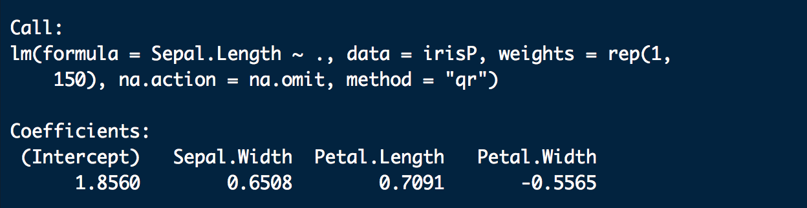

En esta imagen se nos proporciona el valor que se introdujo en el modelo y los coeficientes de la regresión. Si queremos los datos del modelo usamos la función *summary()*

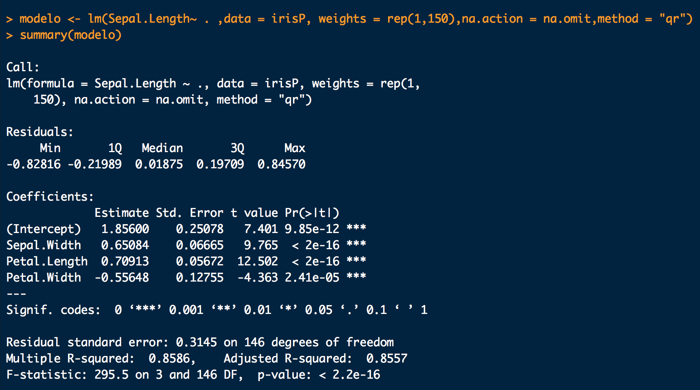

### Aplicando el modelo de regresión lineal en *Python*:

Existen varias librerías para aplicar modelos lineales en *Python*, entre las más populares están *StatsModels* y *sklearn*. Usaremos la primera por ser la que nos proporciona unas funciones parecidas a las que tenemos en *R*. Como el objetivo de este curso es aprender a usar la herramienta, no incluiremos algunos parámetros como los que describimos en *R*.

Para crear el modelo usando la librería *StatsModels*, debemos importar la librería de la manera usual. Luego seleccionamos la variable dependiente e independientes, a diferencia de *R*, *StatsModel* no calcula el valor del intercept por defecto, por lo tanto debemos especificarlo de manera explícita. Esto lo hacemos con la función *add_constant()* de la misma librería, luego usando la función *.OLS()* para crear el modelo y la función *.fit()* para entrenarlo. Finalmente imprimimos los datos del modelo usando la función *.summary()*

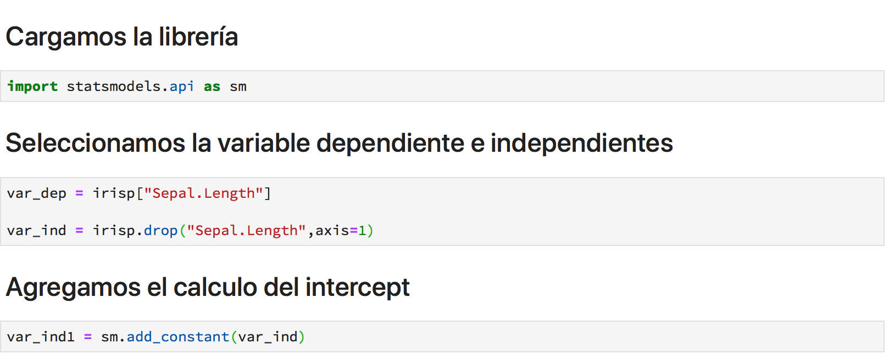

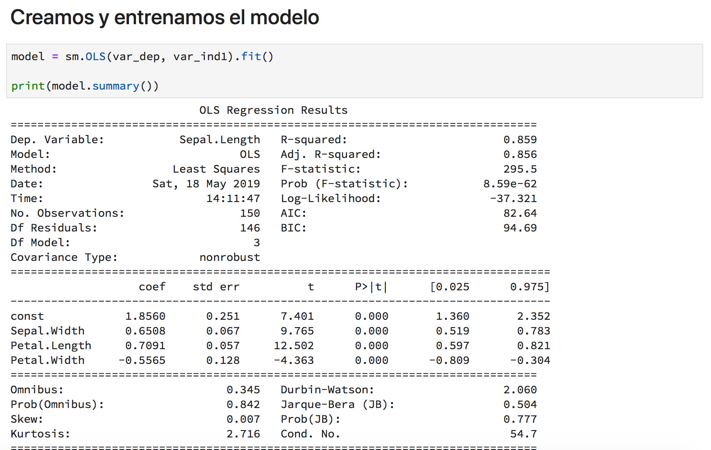

## Cómo interpretar los resultados del modelo

Ya vimos que una vez construido el modelo usando funciones con el nombre de *summary* obtenemos información sobre características de los modelos. Describiremos las más importantes y como entender su efecto en el modelo.
 
### Interpretar con *summary* en *R*:

- *residuals*: Al calcular el modelo, la función *summary* calcula las predicciones para los mismos datos con los que se entrenó el modelo y la variable *residuals* nos da los errores de predicción. Con esta variable se pueden obtener el menor, el mayor, la mediana, primer cuantil y tercer cuantil de los errores. Debemos realizar un histograma de los errores del modelo, si este histograma es distinto a un comportamiento normal, debemos pensar rápidamente que nuestro modelo es inadecuado. A continuación se muestra el código y un histograma ideal, suponiendo que usamos el “modelo” obtenido en la sección anterior

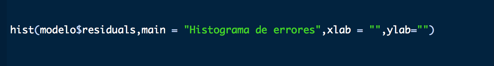

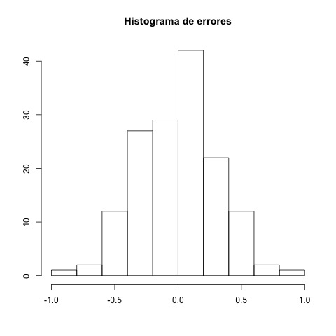

- *Coefficients*: Luego se muestran los coeficientes del modelo en forma de matriz:
    - En la primera columna se muestran los coeficientes del modelo.
    - En la segunda columna se muestran las desviaciones estándares de cada coeficiente.
    - Luego se muestran los valores correspondientes al estadístico $t$, con el fin de realizar una prueba de hipótesis a los coeficientes.
    - En cuarta columna se muestran los $p$-valores de la prueba de hipótesis, los resultados de estos valores deben ser lo más pequeños posibles, en general, se esperan que sean menores a 0.05, en caso de que esto no ocurra, debemos pensar en eliminar la variable del modelo, o realizar alguna transformación adecuada.
    
- *Residual standard error*: Nos da una idea de cómo varía el error de precisión del modelo, es decir, nos dice como varían las predicciones de las observaciones.

- *Multiple R-squared* and *Adjusted R-squared* : En ambos casos ambas valores explican el valor de la varianza explicada del modelo. Se diferencian en que el segundo parámetro considera el número de variables involucradas en el modelo, por lo cual en la mayoría de los casos se utiliza con preferencia sobre el primero  y se buscan valores mayores a 0.7 o 0.8. 

- *$F$-statistic*: Nos presenta el valor del estadístico $F$, luego los grados de libertad y por último el $p$-valor de la prueba de hipótesis que resulta de contrastar el modelo resultante con el modelo que únicamente consta de un término intercept

### Interpretar con *summary* en *Python*

El *summary* en este caso nos da mucha más información que en *R*. Nos concentraremos en las mismas variables del *summary* y mencionaremos algunas otras que pueden ser de utilidad. Este *summary* se divide en dos cuadros:

- Información estadística del modelo: en esta primera matriz la información más relevante es el nombre de la variable dependiente, el número de observaciones, *Multiple R-squared*, *Adjusted R-squared*  y el valor de *$F$-statistic*

- Información estadística acerca de los coeficientes del modelo: en esta matriz se encuentra prácticamente la misma información concerniente a los valores de los coeficientes del modelo, con la información extra que consiste en los intervalos de confianza de los coeficientes.

- Este *summary* no aporta información clara sobre los residuos del modelo. Para poder obtener un histograma y ver su comportamiento usamos el siguiente código, recordando que nuestro modelo se llama "modelo":

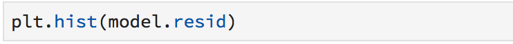

## Realizando predicciones con nuestro modelo

El objetivo principal de crear modelos es usarlos para predecir valores a partir de las variables independientes. A continuación presentaremos los códigos para realizar dicha predicción:

### Realizando predicciones con *R*

Para realizar predicciones con *R* haremos uso de la función *predict()*. Debemos ser cuidadosos con los conjuntos de datos que usaremos para predecir, estos datos deben tener las columnas con el mismo nombre y no tener valores faltantes o espacios en blanco. A continuación se anexa el código para hacer la predicción.

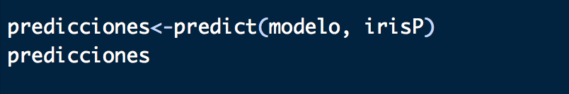

### Realizando predicciones con *Python*

Al realizar predicciones en *Python* debemos tener en claro el orden del conjunto de datos, es decir, debemos tener las variables independientes en el mismo orden con el que se entrenó el modelo, además, debemos agregar una variable intercept para que el modelo tenga todos los parámetros requeridos.

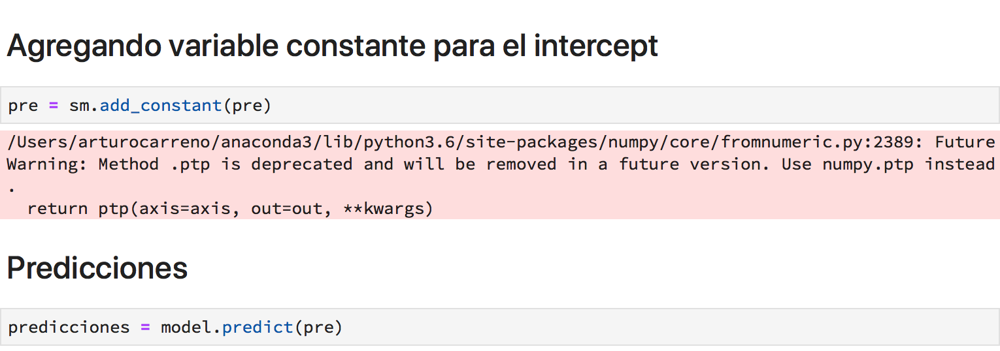