# Árboles de decisión y bosques aleatorios

## Árboles de decisión

Los árboles de decisión son una herramienta muy útil a la hora de elegir entre varias
alternativas, cuando estas son escalonadas, es decir, que los resultados (positivos
o negativos) dependen de una decisión tomada anteriormente. Independientemente del área en que sean utilizados, los árboles de decisión facilitan la visualización y el análisis de las probabilidades de los resultados entre diferentes opciones, mejorando la capacidad de las empresas e individuos para realizar una mejor elección.

Un árbol de decisión es, para quien va a tomar la decisión, un modelo esquemático de las alternativas disponibles y de las posibles consecuencias de cada una. El nombre de la herramienta proviene de la forma que adopta el modelo, el cual semeja un árbol. El modelo está conformado por múltiples nodos cuadrados que representan puntos de decisión. De estos puntos surgen ramas  (que deben leerse de izquierda a derecha), las cuales representan las distintas alternativas. Las ramas que provienen de los nodos circulares o causales representan los eventos. A continuación presentamos un ejemplo gráfico de un árbol de decisión: 

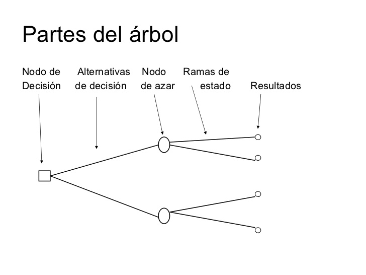

### Árboles de decisión en *R*

Para realizar la construcción de árboles de decisión usaremos la librería *C50*, junto con la función *C5.0()* con una sintaxis  similar a la de la regresión lineal, es decir, ingresamos la variable a predecir seguida de las variables independientes. El segundo parámetro son los datos que se usarán. A continuación se muestra este proceso:

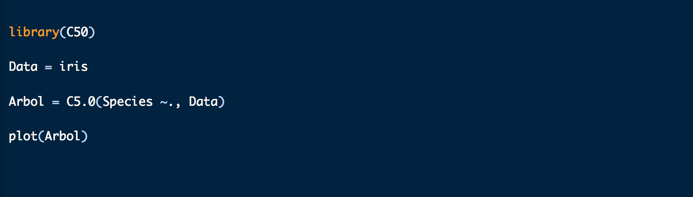

Al usar la función *plot()* obtenemos la gráfica del árbol de decisión calculado.

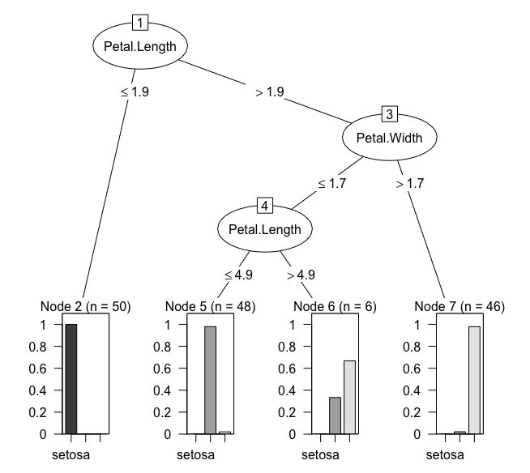

Para hacer predicciones, usaremos la función *predict()* la cual necesita como argumentos el nombre del modelo y los datos a predecir.

Para ello construimos unos posibles datos para predecir los resultsdos del modelo *"Arbol"*, como se muestra en el siguiente ejemplo:

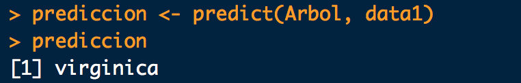

### Árboles de decisión en *Python*

Usaremos la librería *sklearn* y los datos *iris*. Se debe separar la variable a predecir de la variable independiente antes de realizar la construcción del modelo.

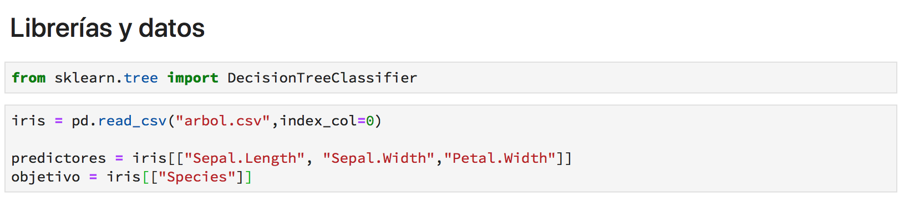

Construimos el modelo usando usando la función *DecisionTreeClassifier()* y luego lo entrenamos usando usando la función *.fit()* agregando como parámetros la variable independiente y las variables independientes.

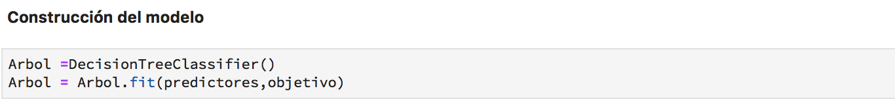

Para realizar predicciones usamos la función *.predict()*

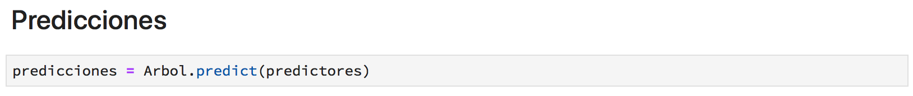

## Bosques aleatorios

Bosques aleatorios es una herramienta que combina árboles de decisión, seleccionando de manera aleatoria una cantidad de variables con las cuales se construye cada uno de los árboles individuales, y se realizan predicciones con estas variables que posteriormente serán ponderadas a través del cálculo de la clase más votada de los árboles que se generaron, para finalmente hacer la predicción. El método promedia una colección de árboles no correlacionados, o decorrrelacionados, y dónde cada árbol depende de los valores de un vector aleatorio de la muestra de manera independiente y con la misma distribución de todos los árboles en el bosque. La generalización del error para los bosques converge a un límite en cuanto el número de árboles en el bosque sea grande. El error de generalización de un bosque de árboles de clasificación depende de la fuerza de los árboles individuales en el bosque y la correlación entre ellos.

## Bosques aleatorios en *R*

Para realizar bosques aleatorios en *R* usaremos la librería *randomForest* la cual facilita la sintaxis necesaria para construir el modelo. Los datos corresponden a la base de datos *iris* y se debe separar la variable independiente de las dependientes para luego usar la función *randomForest()* para construir el modelo. Ésta función necesita como parámetros las variables independientes y la variable dependiente junto al número de árboles a promediar. Anexamos el código para este proceso:

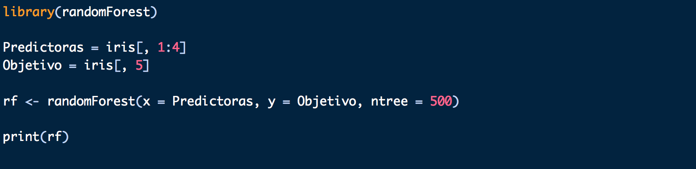

Al realizar el *print* del modelo obtenemos:

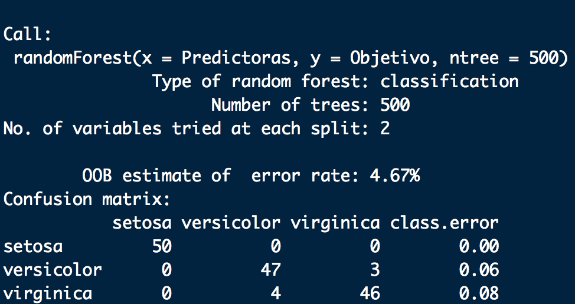

Aquí obtenemos la información sobre cómo se construyó el modelo y la clasificación de los datos. En el ejemplo notamos que el modelo es muy preciso. Las predicciones la hacemos de la manera habitual, usando la función *predict()* incorporando los parámetros correspondientes al nombre del modelo y al conjunto de nuevos datos:

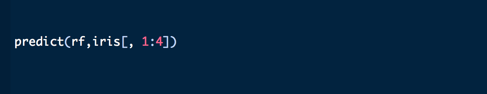

## Bosques aleatorios en *Python*

Usaremos de igual manera la librería *sklearn*, a modo de conocimiento cargaremos los datos *iris* desde *sklearçn*, pero tendremos que hacerles unas modificaciones previas, de la siguiente forma:
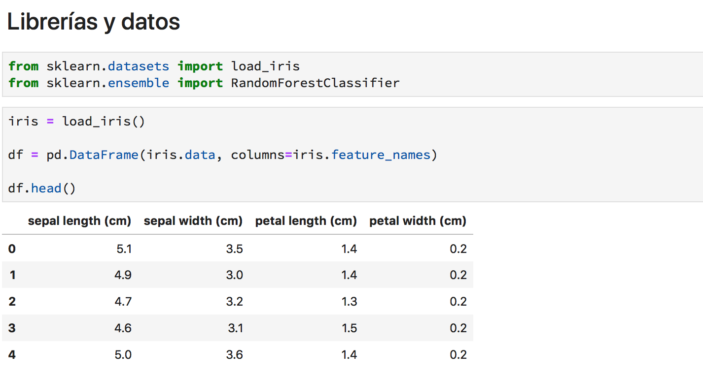

Debemos separar las variables independientes, en otra variable que llamaremos *predictores*. Como los datos carecen de la variable *species* la agregaremos de la siguiente forma:

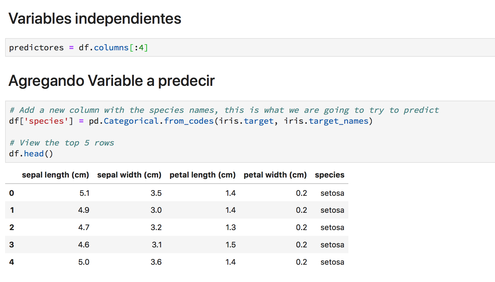

Antes de construir el modelo, aseguramos que la variable sea del tipo numérico con la función *factorize*: 

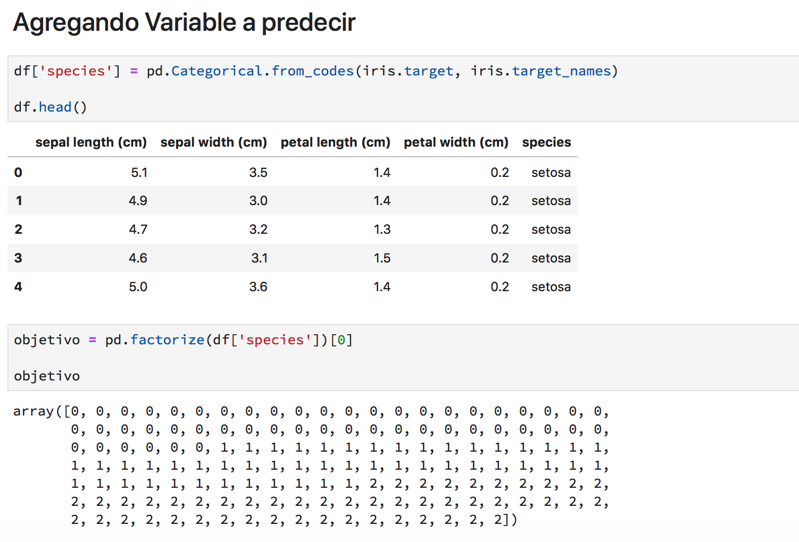

Para crear el modelo usamos la función *RandomForestClasifier()* y *.fit()* para entrenar el modelo.
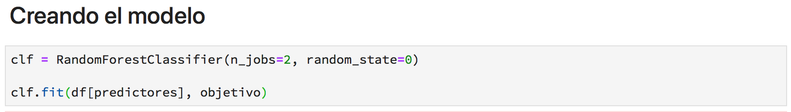

Finalmente, con *.predict()* realizamos predicciones con nuestro modelo.

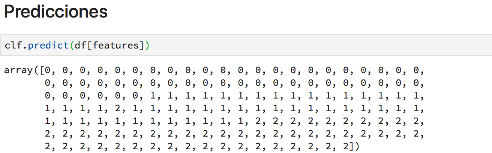

